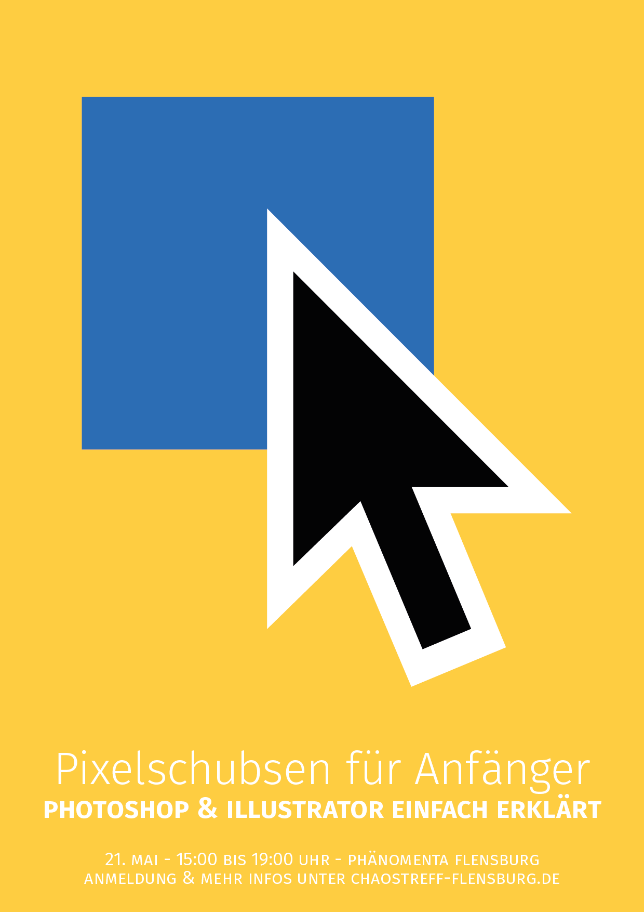

## Chaostreff Flensburg Styleguide

### Einleitung
Wir arbeiten dauerhaft an unserem Design. Wenn du eine Idee hast für eine neues Element oder ähnliches, gestalte einfach ein Beispiel und schicke uns dein Werk.  
Wenn du fragen zum Design hast, frage [@roikiermedia](http://twitter.com/roikiermedia).

Im Ordner [img](./img) befinden sich alle hier gezeigten Grafiken und weitere Elemente und Beispiele zur weiteren Verarbeitung.

---

### Logo

Das Schriftlogo stellt der Schriftzug "chaos flensburg" in der Schriftart "stiff staff heavy" im dreizeiligen Versatz dar. Kein anderes Element wird in dieser Schriftart gesetzt.

Für Bildkompositionen wird das Logo mit der Trixel-Erde und anderen SPACE-Motiven auf dem Trixel-Universe gelegt. SPACE-Elemente erhalten hier sofern möglich ein leichtes überziehendes Leuchten.

### SPACE Elemente

SPACE-Elemente sind Grafikelemente aus dem Bereich Technik, Kultur, Kunst & Maritimes in verschiedenen Pixel-, Trixel-, und Minimalismus-Styles. SPACE-Elemente können zum ausschmücken von Grafiken genutzt werden.

### Typo & Layout
[Fira Sans OTF ](https://www.fontsquirrel.com/fonts/fira-sans)  
[Fira Sans Webfont](https://www.google.com/fonts/specimen/Fira+Sans)

Fließtexte werden in der Schriftart "Fira Sans Regular" gesetzt. Hauptüberschiften werden dabei in der "Extra Light" Stärke gesetzt. Sekundäre Überschriften werden in der Stärke "Semi Bold" in gesamt kleinen Kapitälchen gesetzt. Bei Webfonts sollte die nächst passende font-weight benutzt werden. Ein leichter Versatz von Überschriften und Fließtext schafft Dynamik.

Texte liegen über dem Trixel-Universe auf weißem Grund. Dieser wird an den Rändern durch das gerissene Trixel-Paper gesäumt. Das Papier reicht hier über die Kante des Druckstücks. Leicht angeschrägte Papierflächen sorgen für eine Dynamik. SPACE-Elemente können unter dem Papier herrvorragen oder verdeckt werden und über dem Papier liegen. Das volle Schriftlogo wird nicht überdeckt und kann ebenfalls auf dem Papier liegen. Elemente auf dem Papier besitzen kein Leuchten.

Für spezifische Einzelpublikationen, z.B. Eventplakate ist ein spielerischer Umgang mit modernen und Themenangebrachten Styles gewünscht. Wiederkehrende Elemente, wie Fonts, Logos, SPACE-angelehnte Motive, sind gewünscht.

### Farben  

Chaostreff-Blau: #488dcb  
Chaostreff-Kontrast-Blau: #0A4B91  
Chaostreff-Kontrast-Pink: #F24873  
Chaostreff-Kontrast-Gelb: #FFDD63  
Chaostreff-Kontrast-Orange: #FF8966  
Chaostreff-Weiss: #FFFFFF  
Chaostreff-Schwarz: #262628
